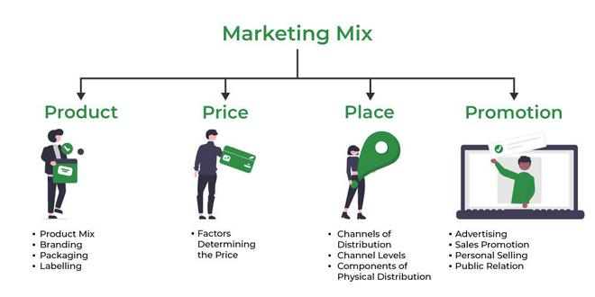

# MARKETING MIX 

## Project

This is a project for the Programming in R subject of CUNEF Master´s in Data Science.
We are going to prepare a data set for a Marketing model project mix. The objective of Marketing Mix Modeling (MMM) is to quantify the effect of advertising in product sales. In this practice you will work with anonymized data from a unknown product.

## What did I use?

- R Studio

## Content of the repository

- data: The data file .csv

- images: Pictures used in Readme.

- html: Script exported as html files.

- script: Script of the project.

## Author

Antonio Nogués Podadera:

- Email: antonionpodadera@gmail.com

- Linkedin: https://www.linkedin.com/in/antonio-nogu%C3%A9s-podadera/

## Project Link: 
https://github.com/antonionogues/marketing_mix_R.git

